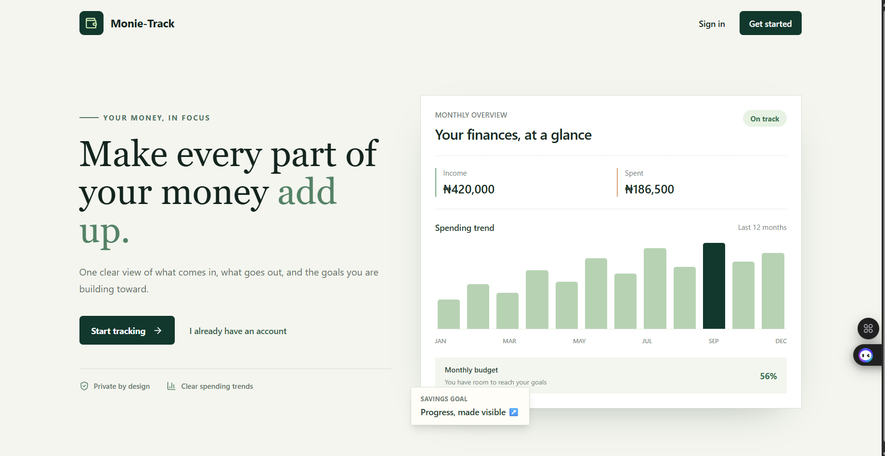
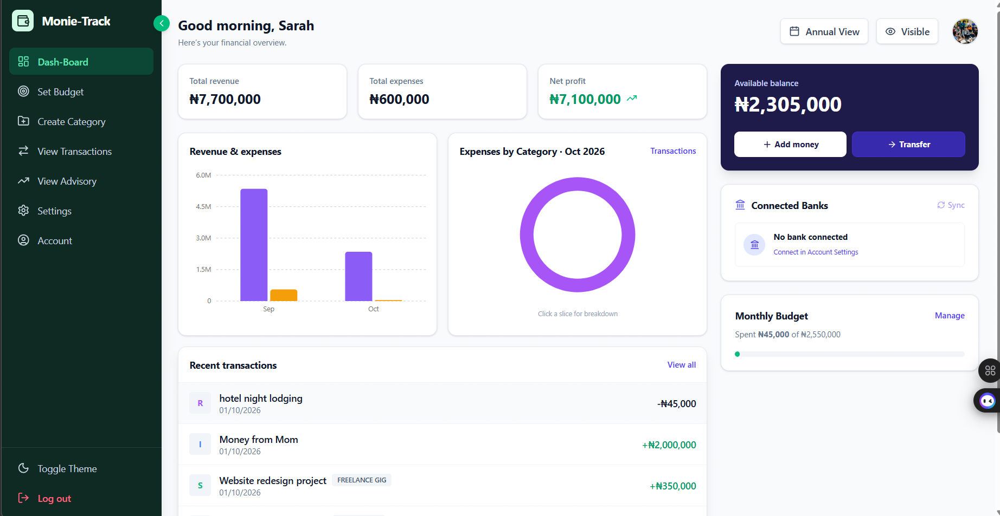
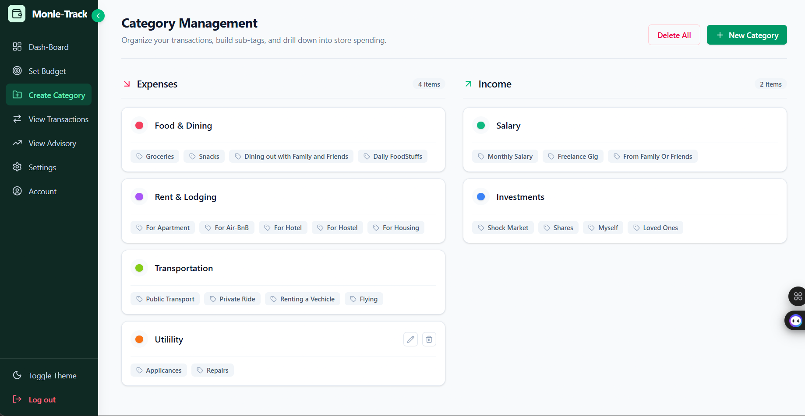
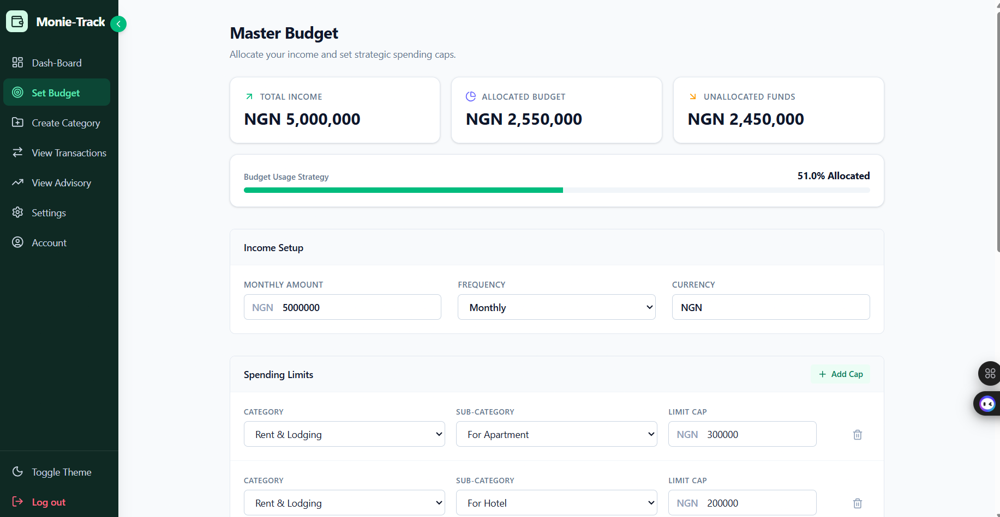

# Personal Finance Tracker

A full-stack personal finance tracker with a React frontend and an Express.js and MongoDB API. Users can manage transactions, categories, budgets, and account preferences from a protected dashboard. Backend APIs also support alerts and Mono bank integration.

## 📋 Table of Contents
- [UI Gallery](#-ui-gallery)
- [Folder Structure](#-folder-structure)
- [Process Workflow & Architecture](#-process-workflow--architecture)
- [Core Features & Capabilities](#-core-features--capabilities)
- [Local Setup & Running](#-local-setup--running)
- [API Testing & Integration](#-api-testing--integration)
- [License](#-license)

---
## 📸 UI Gallery

<div align="center">
  <table>
    <tr>
      <td width="50%">
        <b>Landing Page</b><br/>
        
      </td>
      <td width="50%">
        <b>Dashboard</b><br/>
        
      </td>
    </tr>
    <tr>
      <td width="50%">
        <b>Categories Management</b><br/>
        
      </td>
      <td width="50%">
        <b>Budget</b><br/>
        
      </td>
    </tr>
  </table>
</div>

---

## 📁 Folder Structure
```
personal-finance-tracker/
├── Backend/
│   ├── config/             # Database connection setup
│   ├── controllers/        # Route logic (Auth, Categories, Transactions, Budget)
│   ├── middleware/         # Custom auth and error handling middlewares
│   ├── models/             # Mongoose schemas
│   ├── routes/             # Express API route definitions
│   ├── scripts/            # Database seeding scripts (e.g., seedCategories.js)
│   ├── tests/              # Jest and Supertest test suites
│   ├── utils/              # Helper functions and validators
│   ├── validations/        # Joi validation schemas
│   ├── app.js              # Express application entry point
│   └── package.json        # Backend dependencies
│
├── Frontend/
│   ├── src/
│   │   ├── components/     # Reusable React UI components
│   │   ├── context/        # Global React Context (Auth, Theme)
│   │   ├── pages/          # Full page views (Dashboard, Account, Settings, etc.)
│   │   ├── services/       # Axios API client configurations
│   │   ├── App.jsx         # Main router and app shell
│   │   └── main.jsx        # React DOM entry point
│   ├── index.html          # Vite HTML template
│   └── package.json        # Frontend dependencies
│
|──docs/
|──.gitignore
└── CLIENT-Test.rest        # REST Client HTTP request templates for manual testing

---

## 🏗 Process Workflow & Architecture
---

The application is split into a Vite/React frontend and a modular Node.js backend.

Frontend Application: React pages use React Router for public and protected routes, Axios for API requests, and Tailwind CSS for the interface.

API & Data Modeling: Express routes, controllers, services, and Mongoose models organize authentication and financial data operations.

Security & Authentication: JWT bearer tokens protect private routes. Passwords are hashed with bcryptjs, request bodies are validated with Joi, and API responses use Helmet, CORS, and rate limiting.

Financial Operations: MongoDB stores users, categories, budgets, and transactions. Aggregation pipelines produce dashboard summaries, and category deletion uses a MongoDB transaction to preserve linked transaction history.

Testing & QA: Jest and Supertest cover selected backend flows. The frontend provides build and lint commands; it does not currently have a separate automated UI test suite.

---

##⚙️ Core Features & Capabilities
---
Frontend Application
1 Public Pages: / is the landing page; /login and /register provide sign-in and account creation.

2 Protected Dashboard: /app displays financial totals, charts, recent transactions, and budget progress.

3 Transactions: /app/transactions supports viewing, adding, editing, and deleting income and expense records.

4 Categories: /app/categories lists system and custom categories and supports category management.

5 Budgets & Advisory: /app/budget manages income, currency, and category spending limits. /app/advisory displays spending classifications and budget guidance.

6 Settings: /app/settings saves the user's base currency and monthly income as defaults for new budgets. Existing transactions and budgets are not converted or changed. Theme preference is saved locally.

7 Account: /app/account updates the profile and changes the password after verifying the current password. Logout is available in the application sidebar.

---
Security & Account APIs
---
JWT Authentication: Registration and login return a token; protected routes require a valid Bearer token and reject deactivated accounts.

1 Profile Management: Users can retrieve their profile and update their name, email, base currency, and monthly income.

2 Password Management: The API supports authenticated password changes and forgot/reset-password requests. The frontend's forgot-password link is not yet connected to the reset flow.

3 Custom Middleware: authMiddleware.js validates tokens and loads the current user. errorMiddleware.js returns structured API errors.

Financial Transactions & Categories
1 Category Engine: Supports global default categories and user-created categories.

2 Transaction Tracking: Stores income and expense records linked to categories. Users can list, create, update, and delete their own transactions.

3 ACID Cascading Deletes: Deleting a category reassigns linked transactions to an "Uncategorized" category rather than deleting their financial history.

Dashboard & Budget Advisory
1 Dashboard Aggregation: GET /api/dashboard/summary aggregates income, expenses, balances, category totals, and recent transactions.

2 Budgeting: Budgets store monthly income, income frequency, currency, and category spending caps.

3 Advisory Classification: The advisory service classifies spending as essential, non-essential/cut-back, or miscellaneous, compares spending with budget caps, and provides guidance.

Alerts & Bank Integration
Alerts API: Authenticated endpoints list alerts and mark individual alerts as read. There is no dedicated alerts page in the current frontend.

Mono Bank API: Protected endpoints create a link token, exchange a public token, and synchronize bank transactions. A webhook handles provider updates. The frontend does not currently include the bank-linking widget flow. See docs/bank-integration.md for the integration details and required secrets.

API Route Summary
Authentication: /api/auth/register, /login, /me, /profile, /password, /forgot-password, and /reset-password/:token.

Categories: /api/categories and /api/categories/:id.

Transactions: /api/transactions, /api/transactions/:id, and /api/transactions/sync.

Dashboard: /api/dashboard/summary.

Budgets: /api/budget and /api/budget/advisory.

Alerts: /api/alerts and /api/alerts/:id/read.

Banking: /api/bank/link-token, /api/bank/exchange-token, and /api/bank/webhook.

---

## 🚀 Local Setup & Running
---
Backend
Install dependencies and create a local environment file:

Bash
cd Backend
npm install
cp .env.example .env
Set MONGO_URI to a MongoDB connection string and replace JWT_SECRET in Backend/.env. PORT defaults to 5000. Mono credentials and BANK_TOKEN_ENCRYPTION_KEY are only needed to use the bank integration.

Start the API:
Bash
npm run dev
Frontend
In a second terminal, install dependencies and create the frontend environment file:

Bash
cd Frontend
npm install
cp .env.example .env
Set VITE_API_URL if the backend is not running at http://localhost:5000/api.

Start the frontend:
Bash
npm run dev
Vite prints the local URL, normally http://localhost:5173.

Default Categories
After configuring MONGO_URI, run node scripts/seedCategories.js from Backend to refresh the global default categories.

## 🧪 API Testing & Integration

Automated Test Cases
Run the backend Jest and Supertest suite from Backend:

Bash
npm test
tests/budgetAdvisory.test.js: Checks required budget fields and verifies the essential, cut-back, and miscellaneous transaction classifications.

tests/auth.test.js: Registers a user, updates currency and monthly income, changes the password, logs in with the new password, creates a custom category, and checks category deletion behavior.

In-memory database: The auth integration test uses mongodb-memory-server with a replica set; the first run may download a MongoDB test binary.

Current failing assertion: The category-delete test expects the response to contain safely reassigned, while the controller currently returns Category deleted and transactions reassigned. The test suite therefore does not currently pass in full.

Frontend Checks
Run from Frontend:
Bash
npm run build
npm run lint

The production build passes. The full lint command currently reports existing findings in TransactionContext.jsx, BudgetAdvisory.jsx, Categories.jsx, and Dashboard.jsx.

Manual API Testing

The root-level CLIENT-Test.rest file contains parameterized requests for login, budgets, transactions, advisory, and category operations. Install the VS Code REST Client extension, start the backend, and provide a valid JWT and category ID before running the requests.
---

## 📄 License

This project is licensed under the MIT License.
